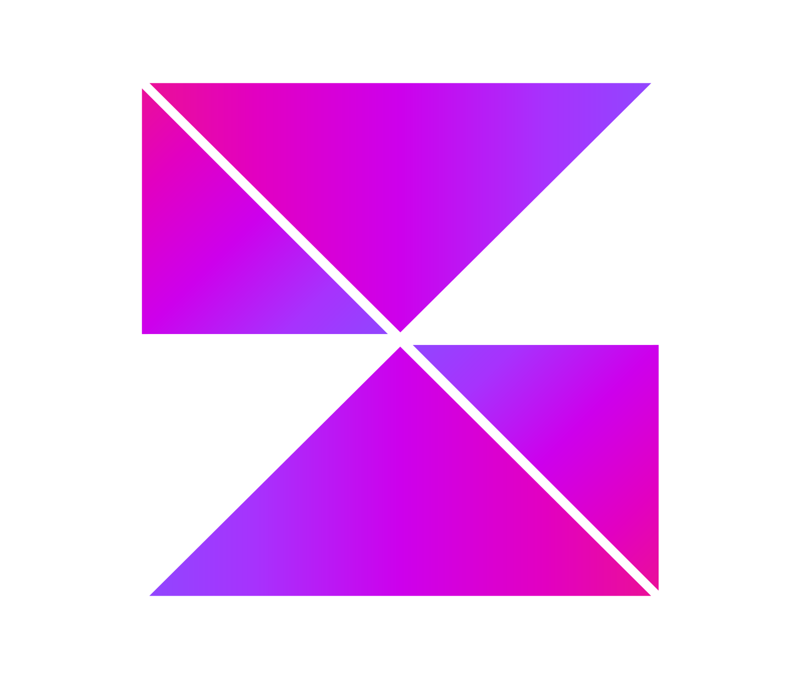

# RFC-003: Zora KMP Kits Hub, Licensing Engine, and Copilot Integration

<p align="center">
  
</p>

* **Status**: Proposed
* **Date**: October 2026
* **Authors**: Jesus Daniel Medina Cruz & Antigravity AI Pair
* **Related Specifications**:
  - [`docs/RFC-001-vision-and-architecture.md`](RFC-001-vision-and-architecture.md)
  - [`especificacion_zora_kmp_starter_kit.md`](/Users/jesusdmedinac/proyectos/JobSearch/docs/especificacion_zora_kmp_starter_kit.md)
  - [`docs/features/09_zora_kits_licensing_and_copilot.feature`](features/09_zora_kits_licensing_and_copilot.feature)
  - [`docs/features/10_zora_branding_and_assets.feature`](features/10_zora_branding_and_assets.feature)

---

## 1. Executive Summary & Business Motivation

KMP-CLI was originally conceived as a developer diagnostics, project inspection, and open skill management tool for Kotlin Multiplatform. While open-source adoption builds brand authority and community goodwill, developers frequently seek **production-grade, opinionated foundational architectures** that solve the 80+ hours of setup required for enterprise KMP applications (Xcode linking, Swift bridging, cross-platform Auth, in-app purchases with RevenueCat, offline database caching, and CI/CD).

The **Zora KMP Starter Kit** ecosystem addresses this demand with three structured tiers:
1. **Zora Community Edition ($0 USD - Open Source):** Kotlin Toolchain + Compose Multiplatform + Koin + Navigation + Ktor base.
2. **Zora Basic Starter Kit ($129–$149 USD - Lifetime):** Full Material 3 UI Kit, Dark Mode, Room KMP offline-first persistence, MVI architecture, and pre-built Onboarding/Settings screens.
3. **Zora Premium Enterprise Kit ($299–$349 USD - Lifetime):** Native Google/Apple Sign-In, RevenueCat subscriptions, Push notifications, Touchlab SKIE Swift bridge, GitHub Actions CI/CD (Play Store AAB & TestFlight IPA), and priority VIP support.

This RFC defines the integration of Zora Kits into KMP-CLI as both a **commercial distribution funnel** and an **execution runtime**, transforming KMP-CLI from a static generator into an **AI-powered development Copilot** for licensed users.

---

## 2. Architecture & System Flow

```
                                 Developer Invocation
                                          │
                        ┌─────────────────┴─────────────────┐
                        ▼                                   ▼
                kmp create --kit ...                   kmp kit list
                        │                                   │
                        ▼                                   ▼
               ZoraKitRegistry                     Interactive Terminal UI
            (Catalog & Metadata)                    (Status, Tiers, Pricing)
                        │
       ┌────────────────┴────────────────┐
       ▼                                 ▼
   Community Tier                  Paid Tiers (Basic / Premium)
  (Free, Open-Source)                    │
       │                                 ▼
       │                    LicenseValidator.validate()
       │                      Checks ~/.kmp/license.json
       │                                 │
       │                   ┌─────────────┴─────────────┐
       │                   ▼                           ▼
       │              [No License]              [Valid License]
       │                   │                           │
       │                   ▼                           ▼
       │         Concierge Sales Screen         Scaffold Full Kit
       │         • Tier Feature Matrix          • Decrypt / Provision
       │         • Time Savings (80+ hrs)       • Configure Identifiers
       │         • Link to jesusdmedinac.com           │
       │         • WhatsApp Concierge Link             ▼
       │                                        Unlock Premium Perks:
       │                                        • kmp kit customize
       │                                        • kmp copilot
       ▼                                               │
   Scaffold Base Project                               ▼
   (Instant, No License)                    AI Multiplatform Copilot
```

---

## 3. Core Capabilities & CLI Commands

### 3.1. Kit Discovery: `kmp kit list`
Displays all available kits in a rich Mordant table:
* Kit ID & Name
* Tier (`COMMUNITY`, `BASIC`, `PREMIUM`)
* License Requirement (`FREE`, `BASIC_OR_PREMIUM`, `PREMIUM`)
* Key Features & Included Modules
* Local License Status (Unlocked / Locked)

### 3.2. Kit Scaffolding: `kmp kit create <kit-id>` or `kmp create --kit <kit-id>`
* **Community Kit:** Clones/scaffolds the open-source base immediately.
* **Basic / Premium Kit:**
  * Checks for a valid license token in `~/.kmp/license.json`.
  * If unauthenticated, displays an informative acquisition screen with links to purchase and returns error code `402` (Payment Required) in `--json` mode.
  * If authenticated, generates the requested production setup.

### 3.3. License Management: `kmp license`
* `kmp license activate <KEY>`: Validates and saves the non-transferable license locally.
* `kmp license status`: Displays the active tier, licensee name, machine fingerprint, and expiration (lifetime for kits).
* `kmp license logout`: Deactivates and clears local credentials.

### 3.4. Kit Customization (Licensed Perk): `kmp kit customize`
Enables licensed developers to toggle architectural components (e.g., swapping Room for SQLDelight, selecting Ktor vs GraphQL, or disabling RevenueCat) and save reproducible corporate templates.

### 3.5. KMP Copilot (Licensed Perk): `kmp copilot`
Provides an interactive AI pairing session inside the terminal:
* Verifies architectural rules (UDF/MVI, proper Coroutine dispatchers on Native).
* Asserts SKIE bridge compatibility for Swift.
* Offers automated code refactoring and migration guidance.

---

## 4. Security & License Verification Model

1. **Non-Transferable Local Binding:**
   The license token bundles a cryptographic signature (Ed25519) containing:
   - Licensee Email / Name
   - Tier (`BASIC` or `PREMIUM`)
   - Hardware Fingerprint / Machine UUID
   - Cryptographic signature signed by Jesús Medina Cruz's private authority key.
2. **Offline-First Verification:**
   The CLI embeds the public key, enabling instant offline verification without requiring continuous internet access or telemetry spying.
3. **Graceful Fallback:**
   No existing open-source KMP-CLI features (`doctor`, `analyze`, `describe`, standard `skills`, core templates) will ever be gatekept behind a license. Only proprietary Zora Kits and advanced Copilot features require a commercial license.
